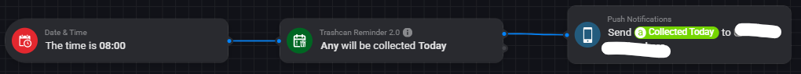
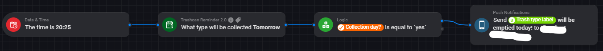
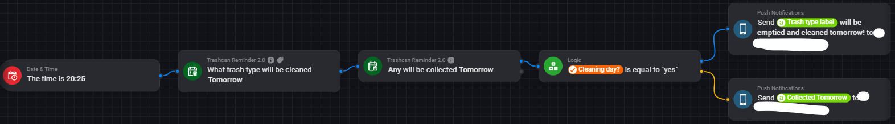

# How to flow with Trashcan Reminder 2.0
Getting the right flow with Trashcan Reminder can be hard, but actually it is quite easy! With one flow you can have your trash pick-up information configured for all types of trash.

## Basic flow
### Trigger (when)
As a trigger you can do a specific time. This is the easiest for a trigger. You can select a time when you want to receive a push notification, or a spoken message, for example: the morning at 8.00

### Condition (and)
In the "and" column you need to make sure that you only get the notification when the trash IS collected. For example, to get notified for all trash types you select "Today" (we want to get the notification for today) and the type is "Any" (we want it for all types).

### Then
In the then we want to send a push notification to a mobile phone with a text. We can do this with the Global Tag that the app provides (and that can be configured in [Settings](settings.md)). Because we want the text for trash that is collected "Today" we need to select the "Collected Today" global tag.

### Changing the basic flow
Let's say you want to receive a notification the day before. Then we have to change the basic flow a bit. The trigger has to be (probably) somewhere in the afternoon. The condition, has to be switched from "Today" to "Tomorrow", since we want to know if the trash is collected tomorrow. In the Then column we have to use the global tab "Collected Tomorrow", because this contains the information of which type of trash is collected tomorrow.

## Advanced Flows
### Trash Collection Notification - Use of global tags
The easiest way to set-up a reminder is by using the global tags. There are three global tags available, for today, tomorrow and the day after tomorrow.
With this you can notify yourself one or two days before a certain container is collected, or on the day itself.

In the screenshot below you see an example flow that reminds you at 8 in the morning to push the trash out when it is collected on that day.
If you want to influence the output message, you can do so via the [Settings](settings.md) screen in the app.

For this flow, you use the card in the "And" column.

### Trash Collection Notification - Use of advanced cards
Another way to set-up a reminder is by using local tags. For this to work you need the card in the "Then" column.
You will get three available tags: Collection day (yes, no), Short Trash Type, Trash Type Label.
The Collection Day will be Yes if ANY trash is collected on that day (you can specify if you want to know it for today, tomorrow or day after tomorrow).
The Short Trash Type, will give you the short trash name.
The Trash Type Label, will give you the trash name as specified in the [Settings](settings.md) screen of the app.

### Trash & Cleaning Notifications
To have a simple notification on whether the container is collected and cleaned you can see the example below.
It will make use of a combination of cards and local tags available from those cards.
