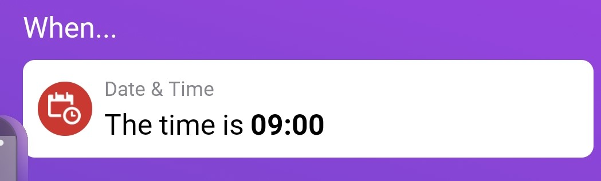
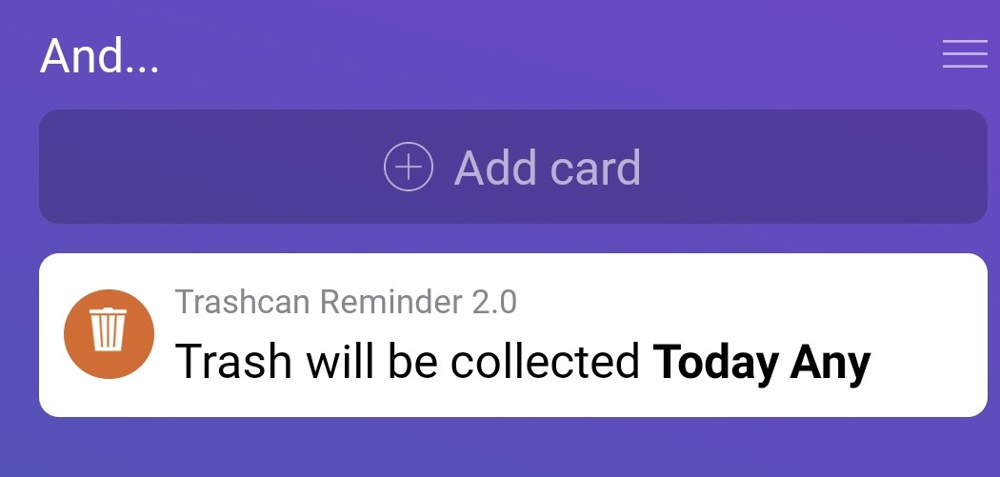
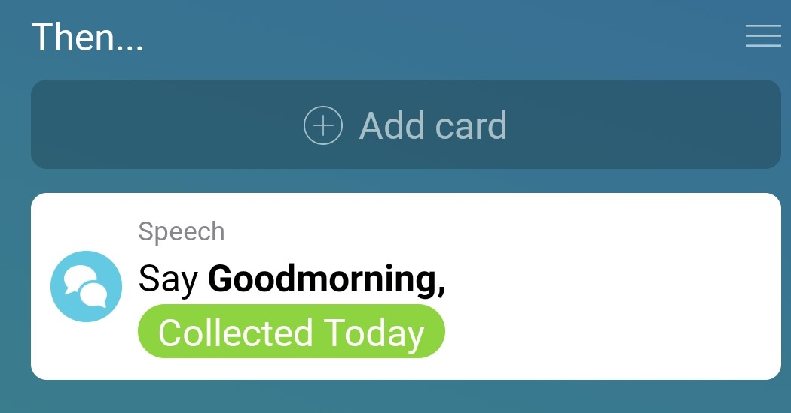

# How to flow with Trashcan Reminder 2.0
Getting the right flow with Trashcan Reminder can be hard, but actually it is quite easy! With one flow you can have your trash pick-up information configured for all types of trash.

## Basic flow
### Trigger (when)
As a trigger you can do a specific time. This is the easiest for a trigger. You can select a time when you want to receive a push notification, or a spoken message, for example: the morning at 8.00

### Condition (and)
In the "and" column you need to make sure that you only get the notification when the trash IS collected. For example, to get notified for all trash types you select "Today" (we want to get the notification for today) and the type is "Any" (we want it for all types).

### Then
In the then we want to send a push notification to a mobile phone with a text, or we want to do a spoken message. We can do this with the Global Tag that the app provides (and that can be configured in [Settings](settings.md)). Because we want the text for trash that is collected "Today" we need to select the "Collected Today" global tag.

### Changing the basic flow
Let's say you want to receive a notification the day before. Then we have to change the basic flow a bit. The trigger has to be (probably) somewhere in the afternoon. The condition, has to be switched from "Today" to "Tomorrow", since we want to know if a trash can is collected tomorrow. In the Then column we have to use the global tab "Collected Tomorrow", because this contains the information of which type of trash is collected tomorrow.